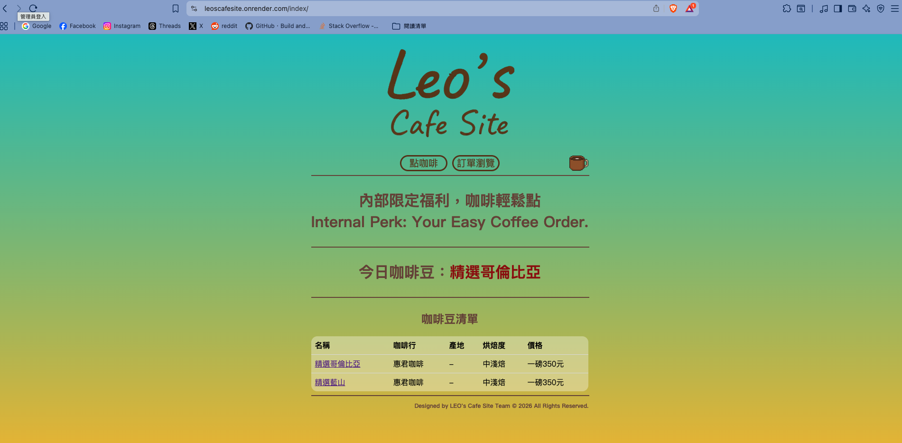
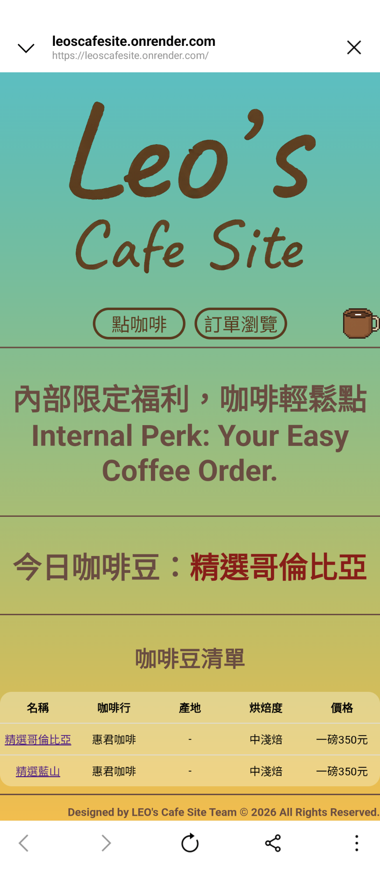

# ☕ Leo's Cafe Site

**Leo's Cafe Site** 是一個專為公司內部員工設計的咖啡訂購系統。旨在簡化辦公室每日的咖啡點餐流程，並提供管理員便捷的咖啡豆庫存與訂單管理界面。

🚀 **即刻訪問網站：** [https://leoscafesite.onrender.com](https://leoscafesite.onrender.com)

---

## ✨ 核心功能

### 👤 員工端 (User Interface)

* **即時瀏覽** ：查看今日供應的精選咖啡豆資訊。
* **輕鬆點啡** ：填寫姓名、溫度偏好與數量即可完成預訂。
* **訂單瀏覽** ：透明化的訂單清單，隨時確認點餐狀態。
* **全裝置支援** ：採用響應式卡片佈局（Responsive Card Layout），手機操作流暢直觀。

### 🛠️ 管理端 (Admin Interface)

* **訂單管理** ：查看、編輯或刪除員工訂單。
* **咖啡豆庫存** ：更新咖啡豆種類、烘焙度、價格與來源連結。
* **今日供應設定** ：選擇當日提供的咖啡款式。

---

## 🛠️ 技術棧

* **後端框架** : Django 6.0
* **資料庫** : PostgreSQL (託管於 Neon.tech)
* **部署平台** : Render
* **前端設計** : HTML5, CSS3 (Flexbox/Grid), 響應式媒體查詢 (Media Queries)

---

## 📸 介面展示

<table>
  <tr>
    <td><b>電腦版介面</b></td>
    <td><b>手機版介面</b></td>
  </tr>
  <tr>
    <td></td>
    <td></td>
  </tr>
</table>
---

## 🚀 本地開發指南

若要在本地環境運行此專案，請參考以下步驟：

1. **複製專案**
   **Bash**

   ```
   git clone https://github.com/leo61405xyz/LEOsCafeSite.git
   cd LEOsCafeSite
   ```
2. **建立虛擬環境**
   **Bash**

   ```
   python -m venv .venv
   source .venv/bin/activate  # Windows 使用 .venv\Scripts\activate
   ```
3. **安裝依賴套件**
   **Bash**

   ```
   pip install -r requirements.txt
   ```
4. **環境變數設定**
   請在根目錄建立 `.env` 檔案並設定資料庫連線資訊（DB_URL）。
5. **執行資料庫遷移與啟動伺服器**
   **Bash**

   ```
   python manage.py migrate
   python manage.py runserver
   ```

---

## 📝 開發日誌 (Recent Updates)

* **2026-04-05** : 優化全站表格，在手機版採用 Card Layout 提升操作體驗。
* **2026-04-04** : 資料庫由 SQLite 遷移至 PostgreSQL，確保數據持久化。
* **2025-10** : 專案啟動，完成員工點餐核心邏輯與 Logo 設計。

---

## 🤝 聯絡資訊

**Leo** - [GitHub Profile](https://www.google.com/search?q=https://github.com/leo61405xyz)
